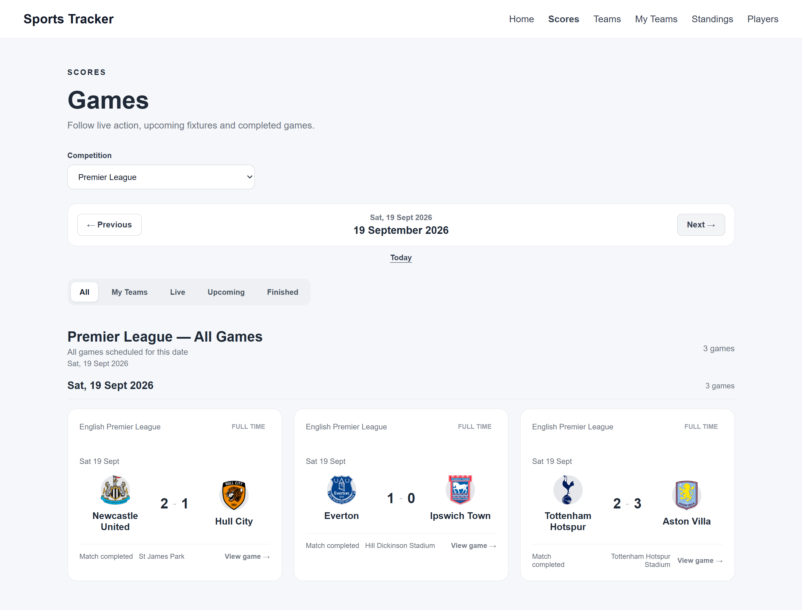
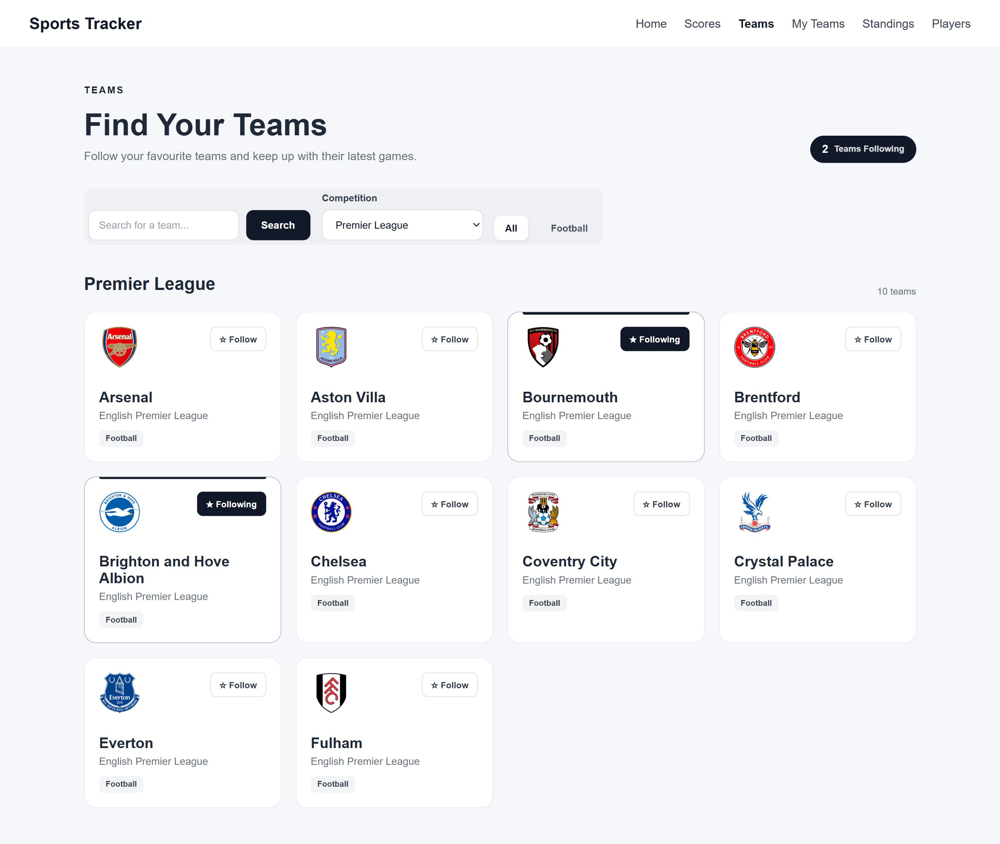
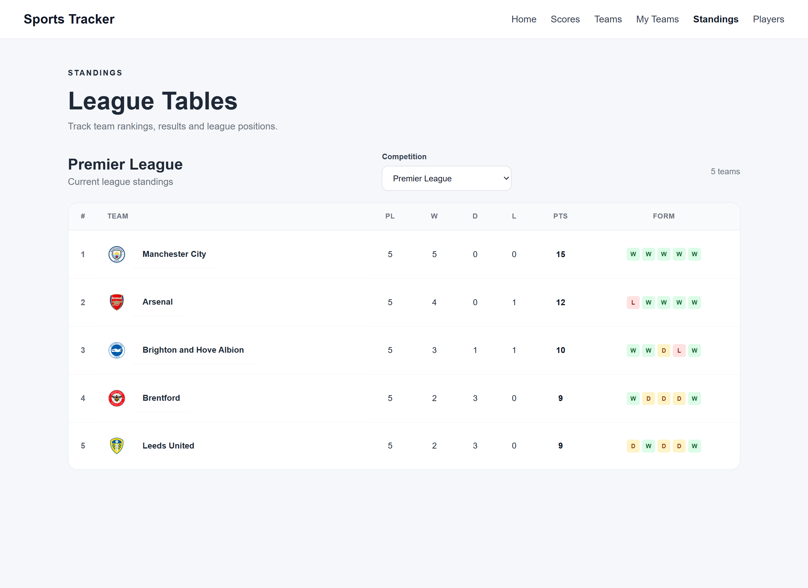
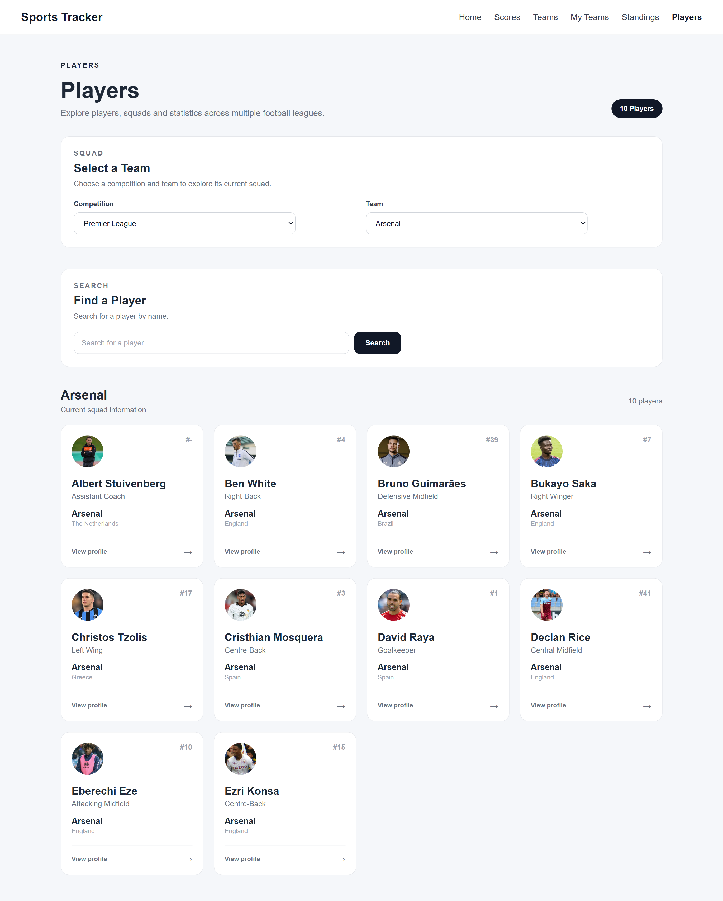
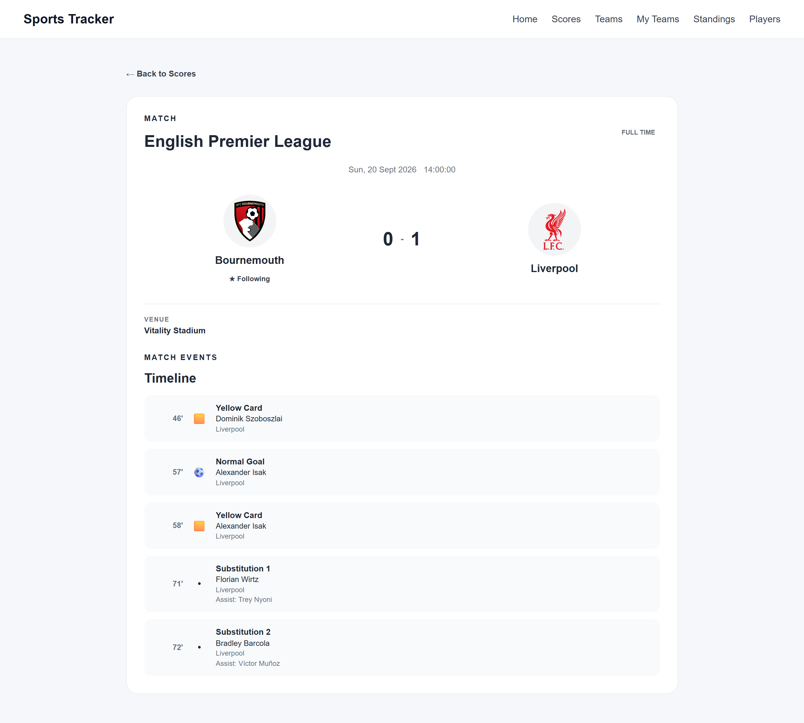

# React Live Sports Tracker

A responsive web application for following football competitions, teams, players, fixtures, results, and league standings in one place.

The application uses **React** and **TheSportsDB API** to retrieve sports data and provides features such as live match tracking, favourite teams, player information, league standings, and detailed match timelines.

## Demo

🌐 **Live Demo:** (https://live-football-games-tracker.netlify.app/)

## Screenshots

### Scores Dashboard



### Teams



### League Standings



### Players



### Match Details



## Features

### Scores & Fixtures

- View football fixtures and results by date.
- Switch between supported competitions.
- Navigate between previous, current, and upcoming dates.
- Filter games by:
  - All
  - My Teams
  - Live
  - Upcoming
  - Finished

- Automatically refresh live games.
- View match details from individual game cards.
- Navigate directly to team profiles from fixtures.

### Favourite Teams

- Follow teams directly from the Teams page.
- Favourite teams are stored persistently in the browser.
- Quickly filter scores to games involving followed teams.
- View followed teams from the My Teams page.
- See upcoming games, live matches, and recent results for followed teams.

### Teams

- Browse teams by competition.
- Search for teams.
- Filter teams by sport.
- View team profiles and information.
- Access a team's upcoming and previous games.
- Follow and unfollow teams.

### League Standings

- View league tables for supported competitions.
- Switch between competitions.
- View team positions and standings information.
- Navigate from standings to individual team pages.

### Players

- Browse players by competition and team.
- Search for players.
- View player profiles.
- View available player statistics.
- Navigate directly to individual player details.

### Match Details

- View detailed information for individual games.
- Display home and away teams.
- View scores and match status.
- Display match date, time, and venue.
- View match timelines when available.
- Automatically refresh live match information.
- Navigate back to the relevant scores page.

### User Experience

- Responsive layout for desktop, tablet, and mobile devices.
- Loading states for API requests.
- Error handling with retry actions.
- Empty states for unavailable data.
- Keyboard-friendly form controls and interactive elements.
- Consistent card-based interface across the application.

---

## Supported Competitions

The application currently supports:

- Premier League
- La Liga
- Bundesliga
- Serie A
- Ligue 1

---

## Tech Stack

### Frontend

- **React**
- **JavaScript (ES6+)**
- **Vite**
- **React Router**
- **HTML5**
- **CSS3**

### API & Data

- **TheSportsDB API**
- REST API requests using the browser `fetch` API

### Development Tools

- **Git**
- **GitHub**
- **VS Code**
- Browser Developer Tools

---

## API

Sports data is provided by **TheSportsDB**.

The application uses the API to retrieve:

- League fixtures
- Previous results
- Teams
- Team information
- Players
- Player statistics
- League standings
- Match details
- Match timelines

API requests are centralized in:

```text
src/api/sportsApi.js
```

Data returned by the API is transformed into application-friendly objects using normalization functions located in:

```text
src/api/normalizers.js
```

---

## Project Structure

```text
src/
├── api/
│   ├── leagueIds.js
│   ├── normalizers.js
│   └── sportsApi.js
│
├── components/
│   ├── ErrorMessage.jsx
│   ├── GameCard.jsx
│   ├── GameTimeline.jsx
│   ├── LoadingMessage.jsx
│   ├── PlayerCard.jsx
│   ├── StandingsTable.jsx
│   ├── TeamCard.jsx
│   └── TeamGameSummary.jsx
│
├── context/
│   └── FavouriteTeamsContext.jsx
│
├── pages/
│   ├── Dashboard.jsx
│   ├── GameDetails.jsx
│   ├── MyTeams.jsx
│   ├── PlayerDetails.jsx
│   ├── Players.jsx
│   ├── Scores.jsx
│   ├── Standings.jsx
│   ├── TeamDetails.jsx
│   └── Teams.jsx
│
├── App.jsx
├── main.jsx
└── index.css
```

---

## Getting Started

### Prerequisites

Make sure you have the following installed:

- Node.js
- npm
- Git

You can check your installed versions with:

```bash
node -v
npm -v
git --version
```

---

## Installation

Clone the repository:

```bash
git clone YOUR_REPOSITORY_URL
```

Navigate into the project:

```bash
cd YOUR_PROJECT_FOLDER
```

Install dependencies:

```bash
npm install
```

Start the development server:

```bash
npm run dev
```

Vite will provide a local development URL, typically:

```text
http://localhost:5173
```

Open the URL in your browser.

---

## Build for Production

To create a production build:

```bash
npm run build
```

To preview the production build locally:

```bash
npm run preview
```

---

## How It Works

The application follows a simple data flow:

```text
TheSportsDB API
       ↓
sportsApi.js
       ↓
Data Normalizers
       ↓
React Pages & Components
       ↓
User Interface
```

For example, when a user selects a competition on the Scores page:

1. The selected competition ID is stored in React state.
2. The application requests fixtures from TheSportsDB.
3. The API response is normalized.
4. The normalized games are passed to the relevant components.
5. Game cards display the fixture information.
6. Users can open an individual game for more details.

---

## State Management

The application uses React state and Context API for managing application data.

The `FavouriteTeamsContext` handles followed teams and keeps the user's selections persistent in the browser.

This allows favourite teams to remain available when navigating between:

- Scores
- Teams
- My Teams
- Team Details

---

## Responsive Design

The interface is designed to work across:

- Desktop
- Tablet
- Mobile

Responsive CSS adjusts layouts, grids, forms, navigation, match cards, player cards, and team activity sections for smaller screens.

---

## Error & Loading Handling

The application includes dedicated UI states for:

- Loading API data
- API request failures
- Empty search results
- Empty favourite-team lists
- Missing match information
- Unavailable player or team data

Where appropriate, users are provided with retry actions instead of being left with a blank screen.

---

## Future Improvements

Potential future improvements include:

- More competitions and sports
- More detailed player statistics
- Additional match events and statistics
- User authentication and cloud-based favourite teams
- Notifications for upcoming matches
- More advanced filtering and search
- Improved caching to reduce unnecessary API requests

---

## What I Learned

This project helped me strengthen my practical experience with:

- React component architecture
- React Hooks
- Context API
- React Router
- REST API integration
- Asynchronous JavaScript
- Data normalization
- State management
- Responsive CSS
- Error and loading states
- Working with third-party APIs
- Git and GitHub workflow

---

## Author

**Luke Olende**

Web Developer | IT & Software Developer

- GitHub: [github.com/Luk30lende](https://github.com/Luk30lende)
- LinkedIn: [linkedin.com/in/luke-olende-2k](https://linkedin.com/in/luke-olende-2k)

---

## License

This project is intended for learning and portfolio purposes.
